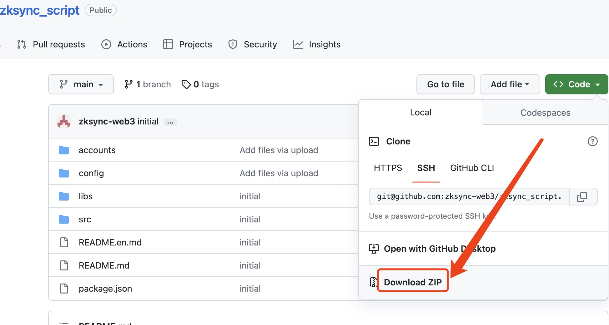

# ZkSync [Era、Lite]网络批量刷空投脚本(ZkSync [Era, Lite] Network Batch Airdrop Script)

## 全网最强zkSync交互攻略(附撸毛神器，撸毛脚本), 搞起来!!!

<a href="./README.md">简体中文</a> ||   <a href="./README.en.md">English</a>

## 脚本能力

- [√] 批量创建账号
- [√] 批量部署合约，成本微乎其微
- [√] 批量使用 OKX 交易所进行批量转账到链上钱包
- [√] zksync lite 网络批量执行转账
- [√] zksync lite 网络批量 Mint NFT
- [√] zksync lite 网络批量进行跨链；eth 网络=>zksync lite 网络
- [√] zksync lite 批量查询网络网络交互次数
- [√] zksync era 网络批量执行转账
- [√] zksync era 网络批量 Mint NFT
- [√] zksync era 网络批量进行跨链；eth 网络=>zksync era 网络
- [√] zksync era 批量查询网络交互次数

## 运行步骤

1. 根据系统进行下载安装 Node，自行搜索教程安装 (https://nodejs.cn/download/)
2. 下载/拉取代码,并且解压</img>
3. 打开终端(命令行)窗口，如果不会看教程
   - mac 系统教程（https://mirror.xyz/0x0d6B556e8132c52be295e4da4DAD26f969e1D759/bQ_JRIZL-ghl6pA3OzRlE3186PIK-F9PXB6OYTMfl8U）
   - window 系统教程（https://mirror.xyz/0xEDdDDc427e707b8dB90ee48dd55bED506DD5840d/l__nLWUs6mL1qAYL59VA4TBCX2xHFCe5oTnRkheip1I）
4. 安装脚本需要的依赖包，在终端(命令行)窗口输入`npm i`
5. 打开 zksync_srcipt 文件夹下的`config`文件夹`index.js`文件，配置相关参数
6. 打开 zksync_srcipt 文件夹下的`accounts`文件夹,文件示例进行配置导入账户相关信息，如果没有请运行脚本命令`create-wallet`进行批量创建钱包账户
7. 在终端(命令行)窗口，运行脚本
   - zksync era 网络 批量自己给自己转账，刷交互次数运行命令： `npm run zksync-era-transfer`
   - zksync era 网络 批量跨链(eth 网络=>zksync era 网络)运行命令： `npm run zksync-era-bridge`
   - zksync era 网络 批量 mint nft 运行命令： `npm run zksync-era-mint-nft`
   - zksync lite 网络 批量自己给自己转账，刷交互次数运行命令： `npm run zksync-era-transfer`
   - zksync lite 网络 批量跨链(eth 网络=>zksync lite 网络)运行命令： `npm run zksync-lite-bridge`
   - zksync lite 网络 批量 mint nft 运行命令： `npm run zksync-lite-mint-nft`
   - zksync lite 网络和 era 网络 查看每个钱包的交互次数(nonce)运行命令, `npm run zksync-era-lite-nonce`

## 全网最强zkSync交互攻略(附撸毛神器，撸毛脚本), 搞起来!!!

一、作为资深从业者，我曾参与过P2P高息投资、股票打新等活动。相比之下，与比特币等数字货币相比，这些投资收益不高或者门槛较高。三年前，我加入了Defi领域，通过参与空投等方式获得了不错的投资回报。这让我更加坚定了在数字货币领域中支持早期项目的信念，成为了一名“薅毛”工作者。

二、 复盘arbitum 众所周知，zkSync非常受欢迎，并有着极高的空投预期。然而，我并不会盲目跟风，每天不加思考地与其交互，等待空投的到来。在决定是否与zkSync交互之前，我喜欢先通过量化数据来辅助做出决策。因此，在制定zkSync交互方案之前，我们将先回顾一下Arbitrum的空投策略。 从下图可以看到arbitum空投参考了下面六个指标
   - 跨链桥
   - 链上交互周期
   - 链上交互tx数或者合约数
   - 链上交易额
   - 跨链到arbitum one的金额
   - 在arbitum活跃交互数

三、确定目标攻略 结合空投指标和资金储备，我这边给出了自己的目标交互攻略：
   - ZkSync lite跨链桥
   - ZkSync era跨链桥
   - 批量mint nft生成tx: 100笔（分到10个月，每周2-3次，成本100刀）
   - 转账给自己生成tx: 40笔（分到10个月，每周1次，成本40刀） 同时准备五万刀分两批冲10个大额号

四、如何操作 除了链上交互外，我还需要解决两个问题
   - 生成一批新账号，账号之间做隔离，避免被女巫
   - 从交易所批量分发交互费用到，利用交易所账号的每日大额流水规避自己分发的女巫判定
以上所有操作通过调研都可以通过脚本自动化完成。
https://github.com/zksync-web3/zksync_script

五、到这里可能有同学会有疑问
  - 使用脚本批量操作怎么隔离ip，怎么防止被判定批量操作？
      - 从技术角度来说链上数据不会收集ip等信息，没必要考虑。同时我们可以通过组合操作，让我们的多个账号完全实现不同的交互行为，比如今天10点50个号mint一批nft同时打包到不同高度的区块，明天下午3点50个号转账给自己同时打包到不同高度的区块，那么脚本的行为跟你手动的交互路径是一致的
  - 为啥不增加交互多样性，交互syncSwap等链上dex？
      - 首先我们要明白，我们要做的是跟公链交互，博空投，自从上线以来zkSync很多项目因为良心不够或者技术不过关圈钱跑路。我们是来撸确定性很大的空投而不是赌博，那就回归最本质的链上行为，转账和mintNft.同时其他链上交互的gas消耗还是比这两要大很多，骑自行车上酒吧该省省，该花花。
  - 要不要一鱼多吃冲点土狗？
      - 土狗在空投的时候会参考跨链桥和链上交互的tx数，如果我们按照攻略来交互已经具备了领土狗空投的条件，没必要再去冲土狗，都是土狗在找我们送空投。同时稳稳的幸福比冲了土狗之后的上串下跳好的多。

六、风险防范
   - 我们项目脚本托管在全球最大的github，公开透明安全，拒绝任何私聊的脚本
   - 脚本中从交易所分发手续费涉及到交易所的apiKey，千万不要暴露给别人
   - 私钥账号非常重要！！！脚本只在自己电脑运行，拒绝任何代交互

在数字货币领域，机会虽然很多，但也很珍贵。许多人会犹豫不决，想要再等等，或者在下次再努力。但实际上，像SUi链打新、Arbitrum的空投等机会，一旦错过就可能再也没有了。因此，我选择先抓住机会，而不是事后后悔为什么没有多抢几个名额。这次，我决定先注册100个账号，以此抓住这个机会。我相信，只有坚定地行动，才能让自己不断前进，赢得更多的机会和回报。
任何行业的繁荣发展都不是少数人的获利，而是需要更多人的推动，才能共同分享整个行业变革带来的红利。因此，我选择公开自己的脚本，以此激励自己不断支持早期项目，并希望能够为更多人的参与提供便利。我相信，只有让更多人参与其中，才能让“薅毛”之路越走越宽，让整个行业得到更好的发展。
